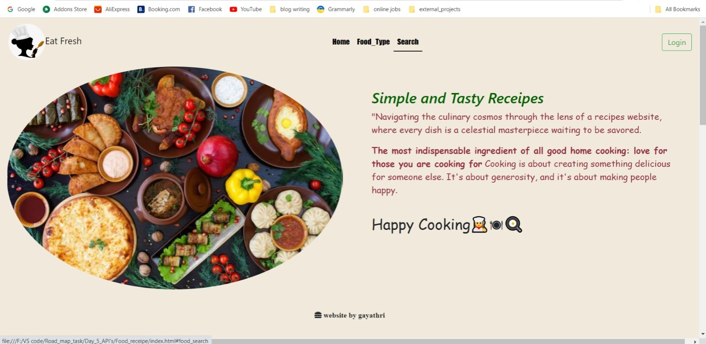
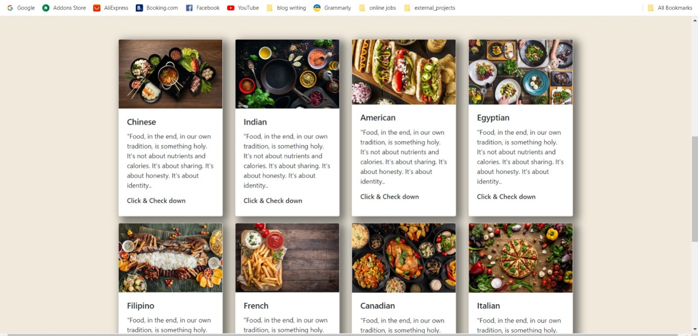
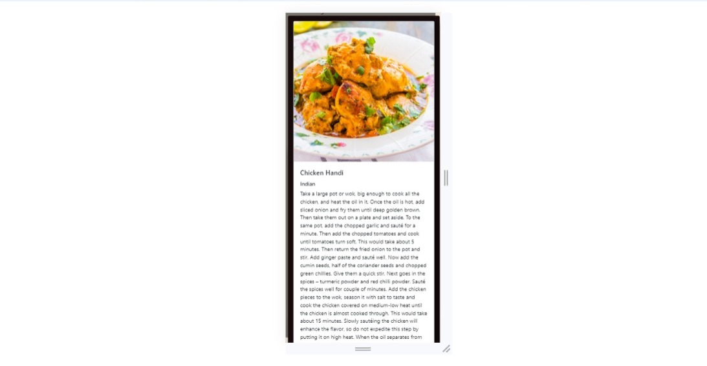

<h1>Search for Food Receipe🍳👩‍🍳</h1>

  <h3>Food-data api</h3> Gives the complete receipe of the searched food with youtube link
<h3>Async & await</h3> 
async ad await method used to wait for the fetch() process to end and used that response as input to the next process.
when using await in async function it wont go next process until that it doesn't go for another process

<h3>Html&css Transitions effort</h3> Here i achieved simple transition efforts using (transition & transform)
 
<h3>Faced Challenges</h3>

It was challenging for me to achieve the transition effect while clicking the div(confirmed, recovered,active, death)
tried out different way of approach. It forced me to make a lot of effort.

<h3>Learned & Used</h3>
<ul>
    <li>DOM manipulation for Nested element</li>
    <li>"Carousel Effect" on Home page</li>
    <li>Bootstrap Responsive(mobile responsive)</li>
    <li>Modal show</li>
    <li>Used iframe to play video in website</li>
  </ul>
<h2>And my output will be with responsivnes</h2>

